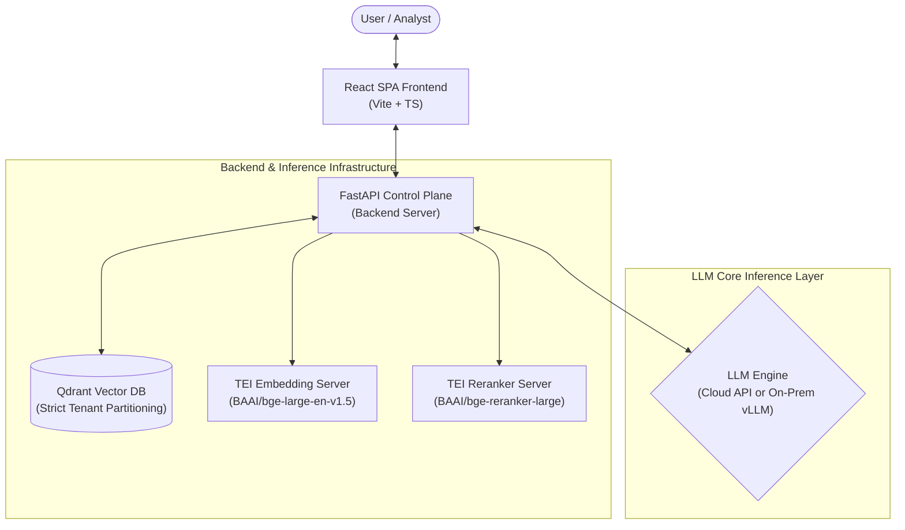

# Enterprise-RAG-V2: Decoupled Multi-Tenant Knowledge Ingestion & Assessment Console

A production-grade, highly scalable, multi-tenant Retrieval-Augmented Generation (RAG) platform. The system enforces strict logical tenant partitioning inside a shared vector database, extracts visually complex borderless financial tables, and routes conversational inference dynamically to specialized model weights, on-prem services, or cloud endpoints.

The application uses a modern **decoupled React SPA frontend** and a **FastAPI backend**, containerized as a single multi-stage build image.

---

## 🎯 Key Objectives

1.  **Strict Logical Tenant Partitioning**: Enforces strict departmental data boundaries (Finance, HR, Legal) inside a single vector pool using Qdrant payload keyword constraints, avoiding the administrative overhead of managing thousands of database collections.
2.  **Structural Document Extraction**: Employs layout-aware visual element extraction (`pdfplumber`) to isolate grid balance sheets and borderless data blocks, mapping them into native Markdown grids before chunking.
3.  **Document Lineage & Version Control**: Automatically marks active document revisions as `"is_latest": true` while deprecating older chunks to `"is_latest": false`. Deterministic UUIDv5 generation overrides duplication and guarantees clean versioning.
4.  **Credential & Configuration Isolation**: Integrates Fernet symmetric AES-128 encryption to secure connection endpoints and credentials on disk.

---

## 🛠️ The Tech Stack

*   **Frontend**: React SPA (TypeScript + Vite)
*   **Backend**: FastAPI (Python 3.11 + Uvicorn)
*   **Vector Database**: Qdrant (1.9+)
*   **Embeddings Compute**: Text Embeddings Inference (TEI CPU/GPU - `BAAI/bge-large-en-v1.5`)
*   **Reranker**: TEI Cross-Encoder Reranker (`BAAI/bge-reranker-large`)
*   **Structural Parsing**: pdfplumber
*   **Text Splitters**: LangChain Experimental Semantic Chunker
*   **Symmetric Encryption**: Cryptography Fernet
*   **Evaluation Framework**: RAGAS (0.4.x) with custom parser sanitizers

---

## 🏛️ System Architecture & Data Flow

Below is a detailed overview of the system architecture, showcasing the data flow from the user interface down to the vector database and inference engines:



### Components Description

1. **React SPA Frontend (TypeScript + Vite)**:
   Offers a real-time console with latency telemetry, dynamic credentials configurations, system health monitoring, and a chat view displaying Time-to-First-Token (TTFT) performance stats. It streams tokens from the backend using Server-Sent Events (SSE).
2. **FastAPI Control Plane**:
   Acts as the central orchestrator. It handles layout-aware parsing (`pdfplumber`), chunking (`Langchain`), credential encryption, and context orchestration.
3. **Qdrant Vector Database**:
   Persists knowledge base vectors and handles logical tenant partitioning by applying filter queries against user metadata parameters at query time.
4. **TEI BGE-Embedding Server**:
   A high-performance Hugging Face Text Embeddings Inference server dedicated to generating vector embeddings for text chunks.
5. **TEI Cross-Encoder Reranking Server**:
   Implements a reranker (e.g. `bge-reranker-large`) to prioritize the most relevant retrieved passages, improving the signal-to-noise ratio in context extraction.
6. **LLM Engine (Cloud or On-Prem)**:
   Performs the final grounded generation.
   * **Cloud-based**: Connects to external providers (such as Gemini, OpenAI) via API endpoints.
   * **On-Premises**: Connects to open-source model instances hosted locally or in-house (such as vLLM).
   * **LLM Setup Guide**: You can configure your own high-performance local LLM serving node by following the detailed guides in the [vLLM Inference Serving Guide](https://github.com/gpu-stack/AI-Infrastructure-Engineering/tree/main/phase2-vllm-serving).

---

## 🏛️ New Production-Grade Features & Updates

### 1. Decoupled SSE Streaming Pipeline
*   **Server-Sent Events (SSE)**: The FastAPI server streams real-time token outputs using SSE (`text/event-stream`). The React frontend parses chunks chunk-by-chunk using Fetch stream readers for zero-lag rendering.
*   **Timing Telemetry**: Displays Time-to-First-Token (TTFT) metrics, generation velocity (tokens/sec), and token budget distributions in a collapsible query trace split-pane.

### 2. Infrastructure Diagnostics & Health Checks
*   **One-Click Diagnostics**: An interactive telemetry grid validates active connectivity states to LLMs (completes a dummy chat call), Embeddings, Reranker, and Qdrant DB collection pools.
*   **Diagnostics SLA Warning Flags**: Tints latency metrics amber when execution limits exceed preset SLAs (e.g. Reranker latency > 300ms, DB query > 100ms, TTFT > 500ms).

### 3. Dynamic vLLM Fallback Routing
*   **Adaptive Target Resolution**: Inspects currently loaded models on the live vLLM `/models` endpoint. If a tenant's registered LoRA adapter weight matrix is missing, the query is routed to the active connection profile's `DEFAULT_MODEL_ID` to prevent `404 Not Found` API crashes.
*   **Synthetic QA Test Case Fallback**: Prevents synthesis loops from breaking on changed server environments by falling back to the active base LLM model.

### 4. Interactive IP Address Masking
*   **Secure Telemetry Presentation**: Masking algorithms automatically replace raw IPv4 target addresses in metrics cards with `***.***.***.***`. Clicking on the masked address toggles it to reveal the real IP instantly, preventing sensitive configuration leakage in screenshots.

### 5. Weighted Ragas Status Grading Matrix
*   **Production Quality Gating**: Run metrics are evaluated against a balanced multi-tier quality gate to determine the `PASSED`, `MARGINAL`, or `FAILED` run status:
    *   **Tier 1 (Hard Gates)**: Faithfulness `> 0.80` and Answer Relevancy `> 0.80`. Failing either forces a `FAILED` result.
    *   **Tier 2 (Health Gate)**: If Tier 1 passes and Context Recall `>= 0.80`, the run is marked `PASSED`.
    *   **Fallback**: Otherwise, the run is tagged as `MARGINAL`.

### 6. Vendor-Neutral Prompt Engineering Layer
*   **Agile Prompt Optimization**: Prompts are optimized to support any instruction-tuned open-source model (Mistral, Llama, Qwen, DeepSeek) without vendor-specific tags. Enforces zero prior knowledge, strict context-only grounding, and exact disclaimers for missing documents.

---

## 🐳 Production Deployment & Containerization Guide

This section explains how to run the Enterprise-RAG-V2 application using Docker and Docker Compose. The configuration is fully decoupled, allowing you to run the frontend-backend console independently and connect to your own existing services, or spin up the entire local infrastructure via Docker.

### 📋 Prerequisites

Before running the application, ensure you have:
1. **Docker & Docker Compose**: Installed and running (Docker Desktop or Docker Engine v20.10+ and Compose v2.0+).
2. **System Resources**:
   * **CPU-only mode**: Minimum 8 GB RAM (16 GB recommended) to host local Hugging Face TEI embedding/reranking servers.
   * **GPU mode (Optional)**: Nvidia GPU with CUDA drivers and `nvidia-container-toolkit` set up if running GPU-accelerated reranking.
3. **Credentials**: An API key for your LLM provider if utilizing cloud APIs (e.g. OpenAI, Gemini) or a running vLLM service URL.

---

### 🚀 Setup & Launch Options

Choose the scenario that matches your infrastructure deployment:

#### Scenario A: Run the Application & Connect to Existing/Host Services
Use this setup if you already have Qdrant, Embedding, or Reranker services running directly on your host machine (outside Docker) or hosted on a remote server/cloud.

1. **Configure Environment Variables**:
   Copy the Docker environment template:
   ```bash
   cp .env.docker .env.docker
   ```
   Open `.env.docker` and configure the Scenario A variables (for host-local endpoints) or Scenario C variables (for remote endpoints). For services running on your local machine, use `host.docker.internal` as the address:
   ```ini
   QDRANT_HOST=host.docker.internal
   QDRANT_PORT=6333
   EMBEDDING_SERVER_URL=http://host.docker.internal:8090
   RERANKER_SERVER_URL=http://host.docker.internal:8081
   ```

2. **Start the Application**:
   Run Docker Compose to pull the pre-built image from Docker Hub and start the application:
   ```bash
   docker compose up -d
   ```
   *The container resolves the host-level services via the `host.docker.internal` gateway automatically.*

---

#### Scenario B: Run the Complete Ecosystem locally in Docker
Use this setup to run the application along with isolated local containers for Qdrant, TEI Embeddings, and TEI Reranking.

1. **Configure Environment Variables**:
   Ensure Scenario B variables are active in your `.env.docker` file (uses container names for automatic resolution):
   ```ini
   QDRANT_HOST=rag-qdrant
   QDRANT_PORT=6333
   EMBEDDING_SERVER_URL=http://rag-embedding-server:80
   RERANKER_SERVER_URL=http://rag-reranker-server:80
   ```

2. **Launch the Infrastructure Services**:
   Depending on your hardware capability, run one of the following commands:
   * **For CPU-only setup**:
     ```bash
     docker compose -f docker-compose.infra.yml --env-file .env.docker up -d
     ```
   * **For GPU-accelerated setup (requires Nvidia GPU + CUDA)**:
     ```bash
     docker compose -f docker-compose.infra-gpu.yml --env-file .env.docker up -d
     ```
   *Note: This command will pull the containers and automatically download the required AI models (`bge-large-en-v1.5` and `bge-reranker-large`) into your local cache directories.*

3. **Launch the Application**:
   Start the application container, which connects to the running infrastructure containers over the virtual network bridge:
   ```bash
   docker compose up -d
   ```

---

### 💾 Data Persistence & Volume Mounts

The application's connection profiles, encryption keys, tenant definitions, and evaluation logs are persisted in a single folder to survive container restarts. 

By default, the `docker-compose.yml` mounts a local directory named `./app_data` to `/app/data` inside the container:
```yaml
volumes:
  - ./app_data:/app/data
```
The application dynamically writes and reads the following files within this folder:
* `.enc_key`: The symmetric key used for config encryption.
* `model_profiles.enc`: Encrypted LLM deployment credentials and settings.
* `tenant_registry.json`: Logical tenant keys mapping to vector scopes.
* `eval_runs.json`: Historical logs of RAGAS assessment runs.

To backup or migrate your RAG configurations, simply copy the `./app_data` folder.

---

### 🛠️ Developer Guide: Building & Pushing the Image

To build the combined frontend/backend application image locally (e.g. after code modifications) and push it to your registry:

1. **Build the Production Image**:
   Uses the multi-stage build to compile React assets, package them with FastAPI, and clean up build overhead:
   ```bash
   docker build -t your-username/enterprise-rag-app:latest .
   ```

2. **Verify Locally**:
   Run the newly built image to test before pushing:
   ```bash
   docker run -d -p 8000:8000 --env-file .env.docker -v $(pwd)/app_data:/app/data your-username/enterprise-rag-app:latest
   ```

3. **Push to Docker Hub**:
   ```bash
   docker push your-username/enterprise-rag-app:latest
   ```
