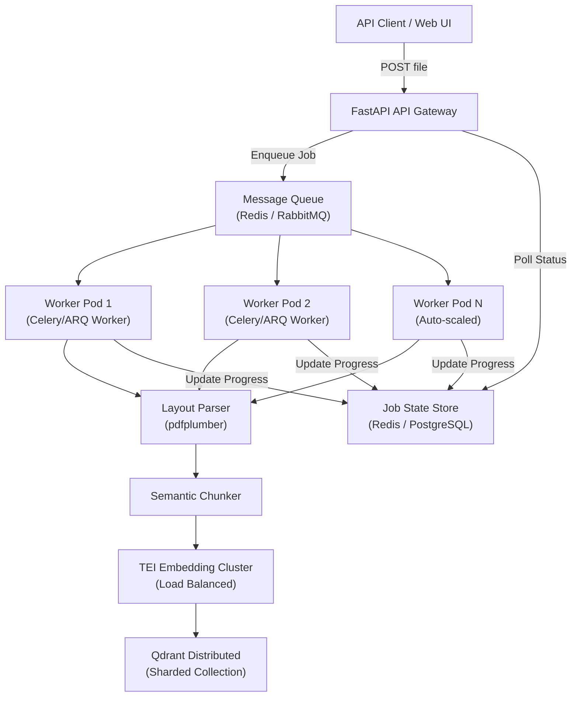

# Enterprise-RAG-V2: Improvement & Scalability Plan

A comprehensive analysis of the current platform covering GUI improvements, application feature gaps, and the architectural changes required to support 100,000+ PDF ingestion at scale.

---

## 1. 🎨 GUI / UX Improvements

The current frontend is a single `App.tsx` file of ~3400 lines — a monolith that needs decomposition and UX refinement.

### 1.1 Component Architecture Refactoring

> [!IMPORTANT]
> The entire UI lives in a single file. This must be split into reusable components.

| Current Problem | Recommended Fix |
|---|---|
| 3,400-line monolithic `App.tsx` | Break into `components/`, `pages/`, `hooks/` directories |
| All state in one `useState` tree | Introduce `React Context` or `Zustand` for global state |
| API calls inline in component bodies | Extract into a `services/api.ts` layer |
| No loading skeletons on data fetches | Add Skeleton UI loaders for health checks, query results |
| IP masking in a click toggle | Already good — keep and refine the UX |

### 1.2 Missing UI Pages / Views

| Missing Feature | Description |
|---|---|
| **Document Library Browser** | A dedicated page to browse, preview, and filter all ingested documents across tenants with metadata (size, version, date ingested, chunk count) |
| **Tenant Analytics Dashboard** | Per-tenant query volume, latency trends (TTFT, reranking ms), and top queried documents in chart form using Recharts or Plotly |
| **Eval Run Comparison View** | Side-by-side comparison of two evaluation runs with delta badges (↑ ↓) on each metric |
| **System Settings Page** | A dedicated settings UI instead of inline modals for connection profiles and runtime parameters |
| **Bulk Upload Progress Tracker** | Real-time progress bars per file during multi-file ingestion |
| **Dark/Light Theme Persistence** | Theme preference currently resets on refresh — persist to `localStorage` |

### 1.3 Accessibility & Responsiveness

- Add `aria-label` attributes to all interactive elements
- Add responsive breakpoints — the UI currently only optimizes for desktop widths
- Add keyboard navigation support for modals and dropdowns

---

## 2. ⚙️ Application Feature Improvements

### 2.1 Ingestion Layer

| Current Limitation | Recommended Enhancement |
|---|---|
| Files processed **synchronously** in the API request thread | Move ingestion to a **background task queue** (Celery + Redis or ARQ) |
| No support for `.docx`, `.txt`, `.csv` in main ingest pipeline (only PDF and Excel) | Add document loaders for `.docx`, `.txt`, `.csv`, `.md`, `.pptx` |
| No per-chunk metadata enrichment | Add `ingested_at`, `page_count`, `word_count`, `doc_language` to chunk payloads |
| `_deprecate_existing_versions` limited to 1,000 points scroll | Use paginated scroll loop to deprecate all points regardless of document size |
| Single Qdrant collection for all tenants | Support multiple named collections per tenant group as an opt-in strategy |
| No ingestion webhook or callback | Add a POST webhook endpoint per ingestion job (for CI/CD pipeline triggers) |

### 2.2 Retrieval & Generation Layer

| Current Limitation | Recommended Enhancement |
|---|---|
| Single retrieval strategy (dense vector only) | Add **Hybrid Search** (dense + BM25 sparse vectors) using Qdrant's built-in sparse support |
| Hardcoded system prompt for HR domain | Make system prompt **tenant-configurable** via a prompt template registry stored per tenant |
| No **conversation memory** / session history in RAG queries | Add a sliding window message history to the RAG query endpoint |
| No **citation confidence scoring** display | Show reranker scores in the citation panel alongside source/page |
| Query context window is static | Add dynamic **context window management** using token budget calculation |
| No support for **multi-document cross-reference** queries | Allow multi-document context merging across document families within a tenant |

### 2.3 Evaluation Layer

| Current Limitation | Recommended Enhancement |
|---|---|
| Eval runs stored only in `eval_runs.json` (flat file) | Migrate eval history to a lightweight SQLite DB or PostgreSQL |
| No scheduled/automated evaluation runs | Add a scheduled RAGAS eval trigger via API or cron |
| Test set generator limited to Qdrant scroll (max 1000 items) | Add configurable sampling strategy for large corpora |
| No A/B testing between two LLM configs | Add an endpoint to compare two active profiles on the same test set |

### 2.4 Security & Multi-Tenancy

| Current Limitation | Recommended Enhancement |
|---|---|
| No authentication layer on FastAPI endpoints | Add **JWT or API Key authentication** middleware |
| Tenant isolation is logical only (no row-level security) | Add Qdrant collection-level isolation as a strict mode option |
| Config stored in Fernet-encrypted file (not suitable for teams) | Add **Vault (HashiCorp) or AWS Secrets Manager** integration |
| No audit logging | Log all ingestion, query, and config change events to a structured log sink |

---

## 3. 📦 100K PDF Ingestion — Scalability Architecture

The current architecture is synchronous and single-node. Scaling to 100,000 PDFs requires a fundamental shift to an asynchronous, distributed processing model.

### 3.1 Bottleneck Analysis


> [!CAUTION]
> The current pipeline processes one file at a time inside the HTTP request thread. At 100K PDFs (avg. 20 pages each), this is ~2M pages. At ~2s/page processing speed, this would take **~460 hours** on a single worker. Parallelism is mandatory.

### 3.2 Target Scalable Architecture



### 3.3 Required Infrastructure Changes

#### A. Asynchronous Job Queue
Replace the synchronous ingestion API call with a background job system:

| Component | Technology Options |
|---|---|
| **Task Queue** | Celery + Redis, ARQ (async Redis Queue), or RQ |
| **Message Broker** | Redis (simple) or RabbitMQ (enterprise-grade) |
| **Job Status Store** | Redis (TTL-based) or PostgreSQL `ingestion_jobs` table |
| **Worker Auto-Scaling** | Kubernetes HPA (Horizontal Pod Autoscaler) or Docker Swarm replicas |

**API flow change:**
```
POST /api/tenants/{tenant_id}/ingest  →  returns {"job_id": "abc123", "status": "queued"}
GET  /api/jobs/{job_id}/status        →  returns {"status": "processing", "progress": 0.6, "files_done": 3}
```

#### B. TEI Embedding Cluster (Horizontal Scale)
The current TEI server has a 16-chunk batch limit and is single-node. For 100K PDFs:

| Requirement | Solution |
|---|---|
| Multiple embedding servers behind a load balancer | Nginx / Traefik round-robin across N TEI replicas |
| GPU-accelerated TEI for speed | Use `ghcr.io/huggingface/text-embeddings-inference:latest` (GPU) |
| Configurable batch size per worker | Expose `MAX_SERVER_BATCH` as an env variable (currently hardcoded to 16) |
| Throughput estimate | A single A10G GPU TEI can process ~500 texts/sec (1024-dim); 3 GPUs ≈ 1500 chunks/sec |

#### C. Qdrant Distributed Mode
The current setup uses a single Qdrant node. At 100K PDFs × avg 50 chunks = **~5M vectors**.

| Concern | Solution |
|---|---|
| Single node memory limit | Deploy Qdrant in **distributed cluster mode** (3+ node sharded collection) |
| Collection sharding | Enable `shard_number: 6` and `replication_factor: 2` in collection config |
| Index type | Switch from default HNSW to **quantized HNSW** (scalar or product quantization) to reduce memory 4-8x |
| Qdrant storage | Use SSD-backed persistent volumes; enable `memmap_threshold` for RAM optimization |

#### D. Storage & File Management
For 100K PDFs, raw file storage in `tempfile` is not viable:

| Current | Scaled Approach |
|---|---|
| Files uploaded directly into API memory | Upload files to **object storage** (S3 / MinIO / GCS) first |
| Temp files deleted after processing | Maintain a file registry in S3 with ingestion status metadata |
| No retry on failed files | Workers implement exponential-backoff retry and dead-letter queue |

#### E. FastAPI Application Layer
The API gateway itself needs to be stateless and horizontally scalable:

| Requirement | Solution |
|---|---|
| Multiple API replicas | Run N FastAPI instances behind Nginx or Traefik |
| Config centralization | Replace file-based `model_profiles.enc` with Redis-cached config or Vault |
| Rate limiting | Add ingestion rate limits per tenant (e.g., max 1000 files/hour) |

### 3.4 Throughput Estimate at Scale

| Component | Throughput |
|---|---|
| pdfplumber (CPU, 4 workers) | ~120 pages/min |
| TEI Embedding (1× A10G GPU) | ~30,000 chunks/min |
| Qdrant upsert (distributed, 3 nodes) | ~50,000 vectors/min |
| **100K PDFs (avg 50 chunks each)** | **~28 hours with 4 CPU parse workers + 1 GPU TEI node** |
| **With 8 CPU parse workers + 2 GPU TEI nodes** | **~8 hours** |

---

## 4. 🗺️ Recommended Implementation Phases

| Phase | Scope | Priority |
|---|---|---|
| **Phase 1** | GUI refactor — split `App.tsx`, add bulk upload progress, persist theme | High |
| **Phase 2** | Auth middleware (JWT/API key), audit logging, tenant-configurable prompts | High |
| **Phase 3** | Async job queue (Celery/ARQ) for ingestion with job status API | High |
| **Phase 4** | Hybrid search (dense + sparse BM25) in Qdrant | Medium |
| **Phase 5** | TEI Embedding cluster load balancing, GPU acceleration | Medium |
| **Phase 6** | Qdrant distributed mode, sharding, quantization | Medium |
| **Phase 7** | Object storage (S3/MinIO) integration for file management | Medium |
| **Phase 8** | Kubernetes deployment manifests, HPA auto-scaling | Low |
| **Phase 9** | Eval automation, A/B testing, structured eval history in DB | Low |
