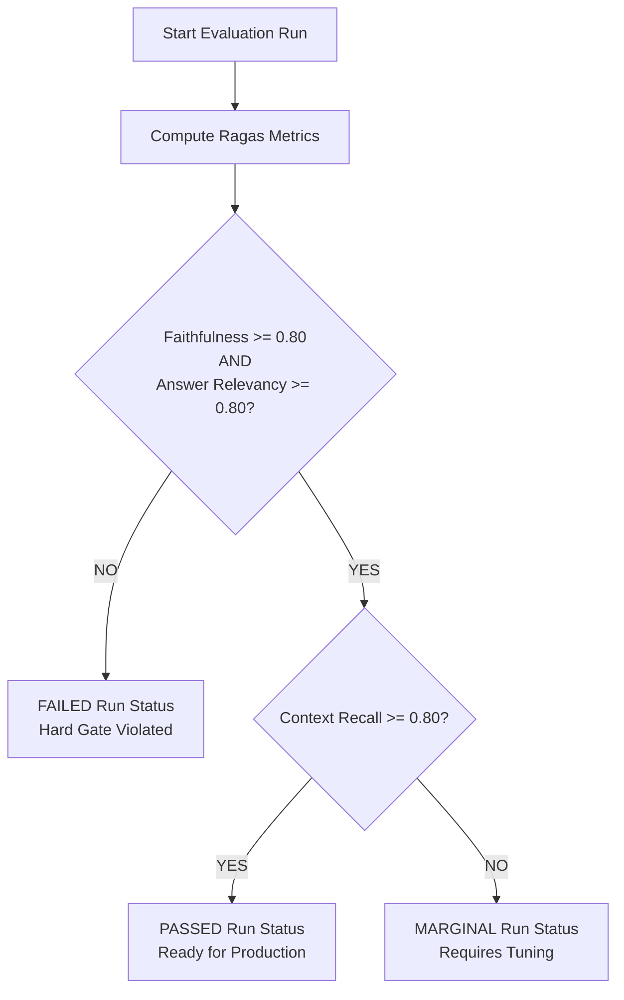

# RAGAS Evaluation & Quality Gating Service

This module handles automated quality audits, test case synthesis, and production deployment gating using the RAGAS evaluation framework.

## 📁 Directory Structure
*   `rag_evaluator.py`: Standardizes evaluation execution, interfaces with Ollama/OpenAI, and parses Ragas scores.

---

## 1. RAGAS Evaluation: What & Why?
RAG pipelines are prone to silent failures: retrieval can return noisy documents, prompts can lead to hallucination, or new model versions can degrade response quality. 

*   **What we use**: The **RAGAS (Retrieval Augmented Generation Assessment)** framework. It evaluates the RAG pipeline components separately without needing human annotators.
*   **Why we use it**: It calculates mathematical scores between the Query, Context, Generated Answer, and Ground Truth. This enables a continuous integration (CI/CD) styled validation gate for every document update or prompt tweak.

---

## 2. Core Features

### Synthetic QA Test Case Generator
Before running an evaluation, you need a dataset of questions and ground-truth answers.
1.  The evaluator pulls a set of vectors for a tenant from Qdrant.
2.  It sends these text chunks to an LLM.
3.  The LLM generates a series of realistic questions and their corresponding ground-truth answers based strictly on that text.
4.  These are saved to `eval_runs.json` to act as the validation benchmark.

### The Four Core Ragas Metrics
*   **Faithfulness** (Answer Grounding): Evaluates whether all claims in the generated answer are found in the retrieved context. (Scores range from `0.0` to `1.0`; detects hallucinations).
*   **Answer Relevancy**: Evaluates whether the generated answer directly addresses the question (penalizes long-winded or evasive responses).
*   **Context Recall**: Evaluates whether the retrieved context contains all the necessary information to reconstruct the ground-truth answer.
*   **Context Precision**: Evaluates whether the most relevant retrieved passages are sorted towards the top of the search results.

---

## 3. Weighted Production Quality Gate

To prevent poor models or corrupted indexing from being deployed, every evaluation run is assessed against a multi-tier quality gate to decide if it is `PASSED`, `MARGINAL`, or `FAILED`:

### Decisive Gates Details:
1.  **Tier 1: Hard Gates (Faithfulness & Relevancy)**:
    If either Faithfulness is `< 0.80` or Answer Relevancy is `< 0.80`, the system automatically tags the run as **FAILED**. This indicates that the engine is either generating hallucinations or failing to answer the user prompt.
2.  **Tier 2: Health Gate (Context Recall)**:
    If Tier 1 passes and Context Recall is `>= 0.80`, the run is tagged as **PASSED**. This means the system successfully retrieved the correct context and generated a grounded answer.
3.  **Fallback Gate**:
    If Tier 1 passes but Context Recall is `< 0.80`, the run is marked **MARGINAL**. This indicates the answer is correct but the retriever missed some key context documents, hinting that chunking parameters or embeddings need tuning.
