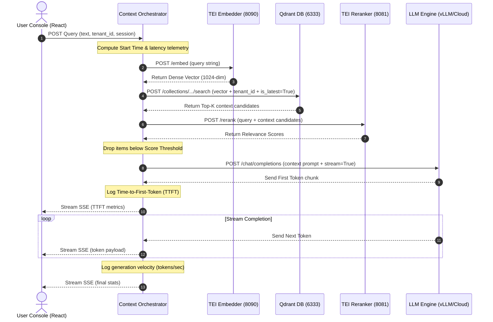

# Generation & Query Orchestration Service

This module governs vector retrieval, context filtering, cross-encoder reranking, prompting strategies, LLM fallback routing, and token streaming.

## 📁 Directory Structure
*   `orchestrator.py`: The core engine coordinating API controllers, database interfaces, model engines, and SSE streams.

---

## 1. Context Orchestrator: What & Why?
The **Context Orchestrator** is the central brain of the RAG query lifecycle. It connects distinct microservices—vector stores, embedders, rerankers, and LLMs—into a single pipeline. 

### Why we need it:
*   **Decoupled Coordination**: Prevents other application layers from knowing about Qdrant schemas, model paths, or provider APIs.
*   **Latency Monitoring**: Logs and structures execution timing for each stage (Embed, Search, Rerank, TTFT) to generate telemetry grids.
*   **Standardized API Response**: Abstracts cloud APIs (Gemini, OpenAI) and on-prem interfaces (vLLM) into a unified inference endpoint.

---

## 2. Core Orchestration Features

### Logical Tenant Isolation
To prevent cross-department data leaks, the orchestrator automatically intercepts every query and builds a strict logical payload filter before querying Qdrant:

```python
from qdrant_client.models import Filter, FieldCondition, MatchValue

# Enforce matching tenant context and fetch only latest document revisions
tenant_filter = Filter(
    must=[
        FieldCondition(key="tenant_id", match=MatchValue(value=tenant_id)),
        FieldCondition(key="is_latest", match=MatchValue(value=True))
    ]
)
```

### TEI Cross-Encoder Reranking
Vector search matches text based on semantic similarity, which often returns irrelevant chunks containing similar keywords.
*   The orchestrator forwards the query and candidate contexts to the **Text Embeddings Inference (TEI) Reranker** server.
*   The reranker calculates an absolute relevance score.
*   Chunks with scores below the `RERANKER_SCORE_THRESHOLD` (default `0.40`) are discarded.
*   Only the top-K reranked chunks are packaged into the LLM system prompt.

### Dynamic vLLM Fallback Routing
If a tenant is using a specialized LoRA adapter on an on-prem vLLM server:
1.  The orchestrator checks the vLLM `/models` registry to see if the Lora adapter is loaded.
2.  If the adapter is missing, instead of failing with a `404 Not Found` API exception, it routes the prompt to the base model (`DEFAULT_MODEL_ID`).

### Server-Sent Events (SSE) streaming
*   Instead of waiting for the full LLM completion (which creates high user latency), the orchestrator yields tokens using Uvicorn-compatible generators.
*   Exposes a stream reader using `text/event-stream`.
*   Includes timing telemetry such as **Time-To-First-Token (TTFT)** in milliseconds and output velocity in tokens/second.

---

## 3. Query Execution & Coordination Flow

The sequence diagram below displays how the orchestrator manages query execution:


