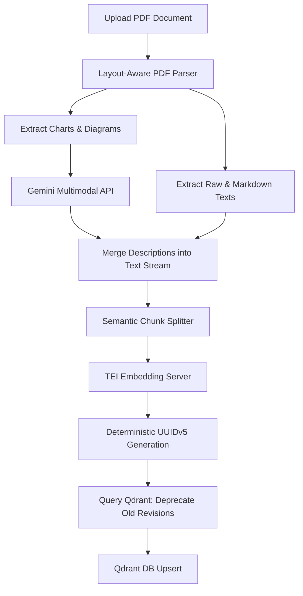

# Ingestion & Document Processing Service

This module handles the parsing, semantic chunking, deduplication, and vector ingestion of documents into the Qdrant database.

## 📁 Directory Structure
*   `layout_parser.py`: Visual extraction of text, tables, and images from PDFs.
*   `semantic_splitter.py`: Breaks down extracted Markdown text into semantically cohesive passages.
*   `ingest_pipeline.py`: Orchestrates the processing flow, computes embeddings, and manages database upserts, deduplication, and lineage versioning.

---

## 1. Tool Selection: What & Why?

### Layout-Aware PDF Parsing (`pdfplumber`)
Standard PDF parsers read text sequentially, ignoring layout. When a document contains multi-column layouts, margin text, or grid-less financial tables (like balance sheets), standard parsers merge cell values and text blocks, destroying semantic structure. 
*   **Why we use it**: `pdfplumber` enables layout-aware visual geometry extraction. It maps coordinates of tables, vertical lines, and borderless data grids, converting them into structured **Markdown tables** so the spatial context is preserved during vector retrieval.

### Semantic Splitter (`langchain_experimental`)
Traditional chunkers split text strictly by character length or token bounds (e.g. 500 characters). This splits sentences in half, causing loss of contextual completeness.
*   **Why we use it**: The semantic chunker splits text based on semantic shifts. It calculates vector embeddings for consecutive sentences and measures the cosine distance between them. A chunk boundary is created only when the semantic difference between adjacent sentences exceeds a specific threshold.

---

## 2. Core Features

### Table Layout Isolation
*   Locates and isolates boundary boxes of rows and columns.
*   Extracts cell text and maps them directly into native Markdown matrices (e.g., `| Column 1 | Column 2 |`).
*   Embeds the table directly into the surrounding text flow to ensure tabular metrics remain grounded in context.

### Multimodal Chart & Diagram Descriptions
*   If a page contains charts, diagrams, or diagrams that cannot be parsed as text, the system extracts the element as an image.
*   Converts the image to base64 and invokes the Gemini multimodal API to generate a detailed textual explanation.
*   Merges the description back into the chunk stream as `[Visual Element: Description...]`.

---

## 3. Ingestion Pipeline & Database Safeguards

### Ingestion Data Flow
The data flow follows this sequence:



### Chunk Deduplication (Deterministic UUIDv5)
To prevent duplicate records from inflating the vector database when the same document is uploaded multiple times, we generate deterministic UUIDs for each chunk using **UUIDv5** (which generates hashes based on a namespace and a unique string):

```python
import uuid

# Namespace based on a DNS constant
NAMESPACE = uuid.NAMESPACE_DNS

# Generate UUID based on Tenant, Filename, and the raw Chunk Text
chunk_uuid = uuid.uuid5(NAMESPACE, f"{tenant_id}:{filename}:{chunk_text}")
```

*   **Result**: If the identical file chunk is ingested again, it yields the exact same UUID. Since Qdrant overrides matching point IDs on upsert, the database automatically replaces the existing record instead of inserting a duplicate point.

### Document Lineage & Version Control
When a tenant uploads an updated version of a document, older chunks must be marked as legacy:
1.  **Retrieve Existing Lineage**: Before saving new vectors, the pipeline queries Qdrant to find all existing points matching the `tenant_id` and `filename`.
2.  **Mark Legacy Chunks**: The payload field `"is_latest"` for these older chunks is updated to `false`.
3.  **Ingest New Chunks**: The newly created vectors are upserted with `"is_latest": true`.
4.  **Runtime Advantage**: During RAG queries, the search filter automatically includes `{"is_latest": true}`, preventing older/outdated document information from corrupting search results while retaining history.
